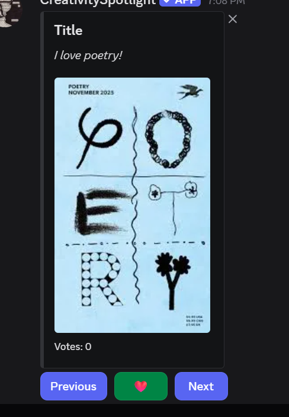
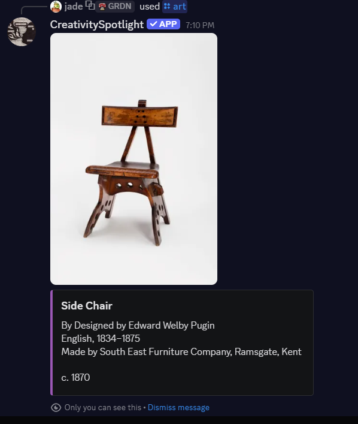
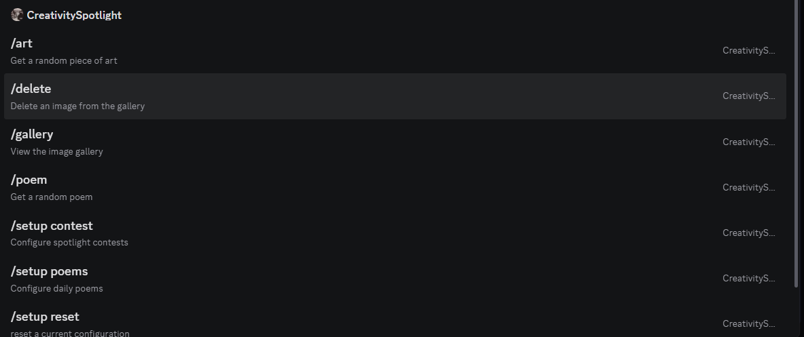
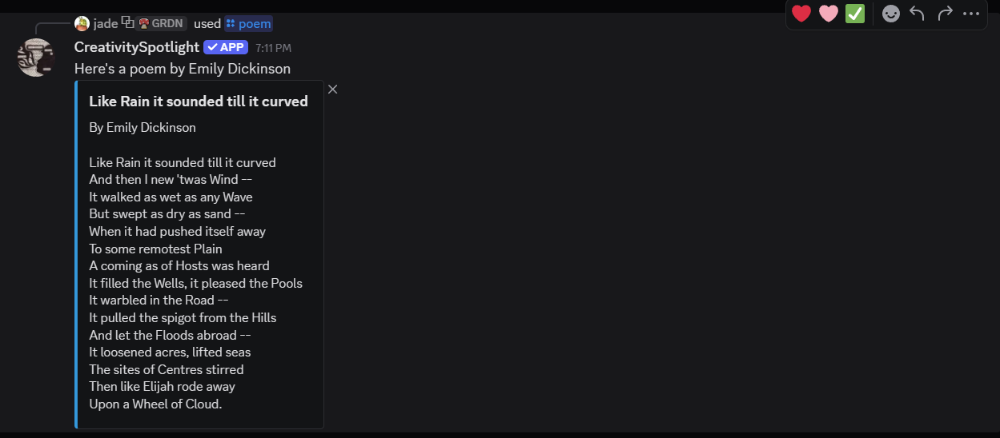
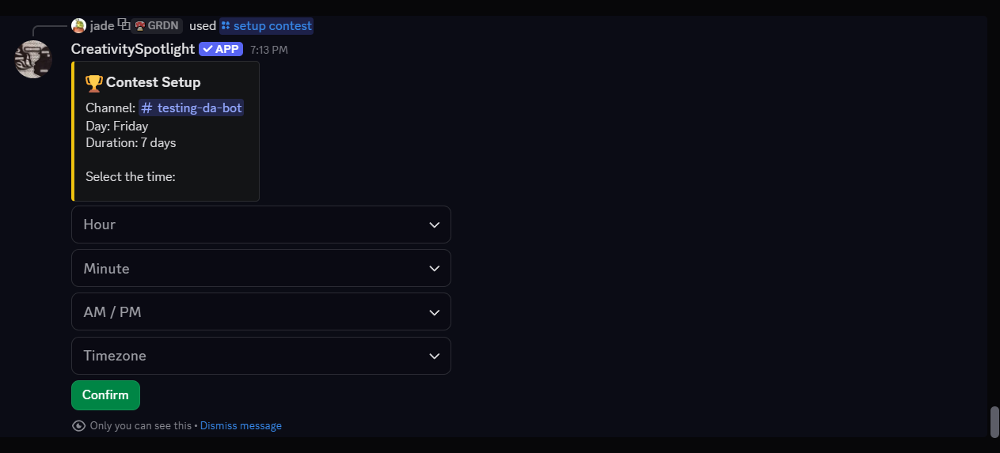
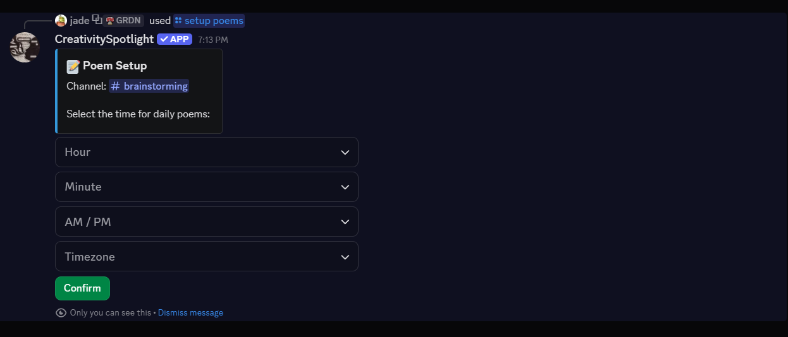

# Creative Spotlight

Creative Spotlight is a Discord bot ecosystem designed to keep communities active through **art discovery**, **poetry prompts**, and **friendly creative contests**.

It includes:
- A **Python Discord bot** with slash commands, interactive gallery tools, and scheduling flows.
- A **Spring Boot backend** for gallery, voting, and guild configuration persistence.
- A **PostgreSQL database** for reliable data storage.

## Why Creative Spotlight? 

Creative Spotlight helps new and growing artists:
- spark daily conversation with low-friction creative prompts,
- showcase work in a shared gallery,
- enter in weekly contests to get showcased and stand out,

## Feature highlights

### 1) Interactive gallery with voting
Members can browse submissions in a paginated viewer and vote with a ❤️ button. This makes community favorites easy to discover and celebrate.

### 2) Random art discovery (`/art`)
The bot can post a random artwork (with metadata) from museum sources, giving members inspiration and discussion starters.

### 3) Poetry discovery (`/poem`)
The bot fetches poems (including author/title details), great for writing prompts, reflection threads, and themed events.

### 4) Contest automation (`/setup contest`)
Admins can configure:
- destination channel,
- contest day,
- posting time,
- timezone,
- contest duration.

After the configured period (for example, 7 days), the bot announces the winning submission.

### 5) Daily poem scheduling (`/setup poems`)
Admins can set a dedicated channel and daily posting time for recurring poem drops.

### 6) Moderation tools (`/delete`)
Admins can remove gallery submissions directly through an in-app selection flow.

## In-app screenshots

### Gallery browser + voting


### Random art lookup (`/art`)


### Command menu overview


### Poem response (`/poem`)


### Contest scheduling setup (`/setup contest`)


### Daily poem scheduling (`/setup poems`)


### Delete submission flow (`/delete`)


## Slash commands at a glance

- `/art` — get a random artwork.
- `/poem` — get a random poem (supports optional author/title filtering).
- `/gallery` — browse gallery images and vote on favorites.
- `/delete` — remove an image from the gallery.
- `/setup contest` — configure spotlight contests.
- `/setup poems` — configure daily poem posting.
- `/setup reset` — reset current server configuration.
- `/upload` — upload one or multiple works of art at once to display in a grouped gallery or one single gallery, and don't forget the title!

## Project structure

```text
.
├── bot/                      # Python Discord bot
│   ├── commands/             # Slash command cogs
│   ├── scraping/             # Poem scraping utilities
│   └── main.py               # Bot entrypoint
├── backend/                  # Spring Boot REST API
│   └── src/main/java/...     # Controllers, services, repositories, models
├── tests/                    # Python tests
├── docker-compose.yml        # Local multi-service orchestration
└── Dockerfile                # Bot container image
```

## Requirements

### Local development
- Python 3.10+
- Java 17+
- Maven 3.9+ (or use `backend/mvnw`)
- PostgreSQL 16+

### Containerized development
